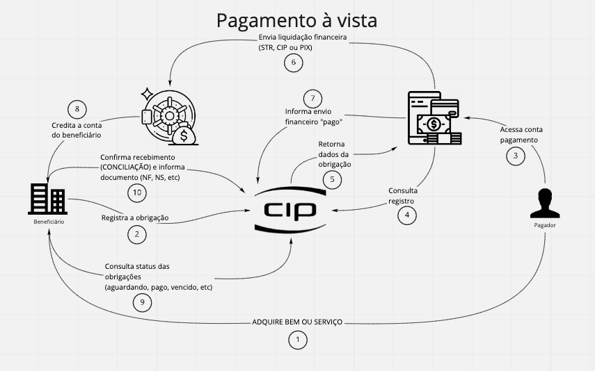

<h1>
  Megahack - CIP
</h1>

<small>
<a href="https://miro.com/app/board/o9J_kvTkvmU=/">Miro Board</a> 
<a href="https://docs.google.com/document/d/1A_mswkxDpoxGo43qppBXYW_XOFPF3TCJFNY04T1UlBI/edit">Description</a> 
<a href="https://www.youtube.com/watch?v=2PPu8cfzK7Q">Youtube Video</a>
</small>

## Features

This back-end features the latest tools and practices in web development!

- 💹 **Express** — JavaScript back-end Framework
- 🐋 **Docker** — Containers
- ♻️ **Bee Queue** — Task queue for jobs (uses Redis)
- 💌 **Nodemailer** - E-mails
- 🖼️ **Handlebars** - View template (used for e-mails)
- 💖 **PostgreSQL** — For geneeral data (except notifications and jobs)
- 💖 **MongoDB** — For notifications
- 💖 **Redis** — For jobs

I've used other libraries too, like **multer** for file uploads; **youch** and **sentry** for errors; **jsonwebtoken** and **bcrypt** for authentication.

## Getting started

First you need to have `node` or `yarn` installed on your machine.
You'll also need `docker compose`.
Then, you can clone this repository and run the following commands inside the project folder:

1. `git clone https://github.com/robertveloso/megahack.git`

2. `yarn dev`;

3. As soon as the Postgres instance is running, open another terminal and run: `yarn migrate` you might need to change the .env to 'localhost', 'postgres' or 'ip address'.

4. import the insomnia.json to your insomnia client.

> ps.: don't forget to create the `.env` (please duplicate `.env.example`).

You can even run `yarn test` after created `.env.test`!

## :memo: License

This project is licensed under the MIT license. See the file [LICENSE](LICENSE.md) to obtain more details.

## Challenge

> "Que tipo de solução pode tornar mais conveniente (simplicidade, segurança e eficiência) o serviço de pagamento de contas tanto para pessoas físicas, quanto pessoas jurídicas? E em relação ao beneficiário (recebedor do valor cobrado por um bem ou serviço), como podemos tornar mais eficiente a questão da conciliação/controle das contas a receber?

> Um brasileiro paga, pelo menos, sete contas por mês, entre água, luz, gás, telefonia, internet, IPTU, aluguel ou condomínio, plano de saúde entre outras. Pode ser que você nunca tenha passado por essa situação, mas muitas pessoas nem sempre conseguem quitar suas contas nos bancos em que são clientes. Isso porque nem todas as instituições financeiras estão habilitadas a receber o pagamento destas contas.

> Além disso, o Brasil tem mais de 45 milhões de pessoas que não possuem conta bancária (os chamados desbancarizados), mas que também precisam pagar seus compromissos. Por isso, queremos transformar as dores de uma jornada de pagamento – que não termina no ato de pagar a(s) conta(s) – em oportunidades de melhoria.

> Pense que as pessoas e empresas precisam arquivar ou ter a possibilidade de recuperar as informações de pagamento, seja para: (i) comprovar ao um cobrador ou fornecedor, (ii) apresentar ao fisco que seu tributo foi quitado e (iii) utilizar informações para seu imposto de renda.

> Um pagamento mal administrado pode trazer muita dor de cabeça para todos os lados. Mas esse cenário pode mudar quando oferecermos uma solução que:

> Seja simples e eficiente – Que uma pessoa (física ou jurídica) consiga pagar seus compromissos em um canal eficiente e produtivo, de fácil acesso e de simples operacionalização, que gere uma experiência positiva ao usuário. E que ele tenha à disposição suas informações de pagamentos.

> Seja conveniente e seguro – Que o pagador (desbancarizado ou não) não necessite se deslocar com dinheiro em seu poder para liquidar seus compromissos em um banco ou em um correspondente bancário (ex.: Casa Lotérica), gerando desgastes e, sobretudo, insegurança. Afinal, diariamente os noticiários mostram o aumento dos índices de criminalidade na modalidade de “saidinha” de bancos.

> Que o controle de contas a receber seja eficiente – Que o beneficiário tenha uma solução que possibilite a conciliação (controle sob os recebimentos efetuados) ágil e eficiente, permitindo pleno controle do que, de fato, foi recebido em seu favor pela prestação de um serviço ou venda de um bem, possibilitando alertas sobre seus pagamentos e ou recebimentos."
> </small>

---

Made with love ♥ by Robert Veloso :wave:.
[Get in touch with me](https://www.linkedin.com/in/robertveloso/),
[or discord me!](https://discordapp.com/channels/@me/robertveloso#1547)

Our hackathon team: 
[@Linkedin do João Paulo, Business](https://www.linkedin.com/in/jpterrazam)
[@Linkedin do Diego Pujol Alvares, Marketing](https://www.linkedin.com/in/diego-pujol-alvares-59429025)
[@Linkedin do Roger, Developer](https://www.linkedin.com/in/roger-sebastiany-0b3828108)
[@Linkedin da Tatiane Paulo, UI/UX Designer](https://www.linkedin.com/in/tatianaasilva/)
